```lisp
 ____________________________ 
< Live long and prosper 🖖 >
 ---------------------------- 
  \
   \   \_\_    _/_/
    \      \__/
           (oo)\_______
           (__)\       )\/\
               ||----w |
               ||     ||
```

#### nonomino.conf
```toml
title     = "developer"
name      = "Anas"
username  = "nonomino"
homepage  = "nonomino.is-a.dev"

[skills]

[skills.langs]
great_at = [
    "Ruby",
    "Python",
    "JS",
    "Java",
    "Go",
    "C & C++"
]

learning = [
    "Haskell",
    "Rust"
]
```

### GitHub Summary

<div align="center">
  <table>
  <tr>
    <td> 
      
    </td>
  </tr>
  <tr>
    <td>
      
    </td>
  </tr>
  </table>
</div>
